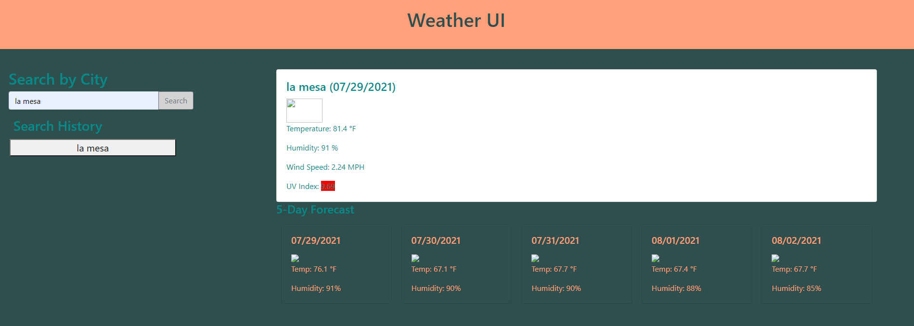

# Weather App

## Description

The purpose of this assignment was to create a functional weather dashboard that displayed the current weather for the given location, and a weather prediction for the next five days.

## Deployed Application

https://am-cowles.github.io/Weather-App/

## User Story

```
AS A traveler
I WANT to see the weather outlook for multiple cities
SO THAT I can plan a trip accordingly
```

## Screenshot


